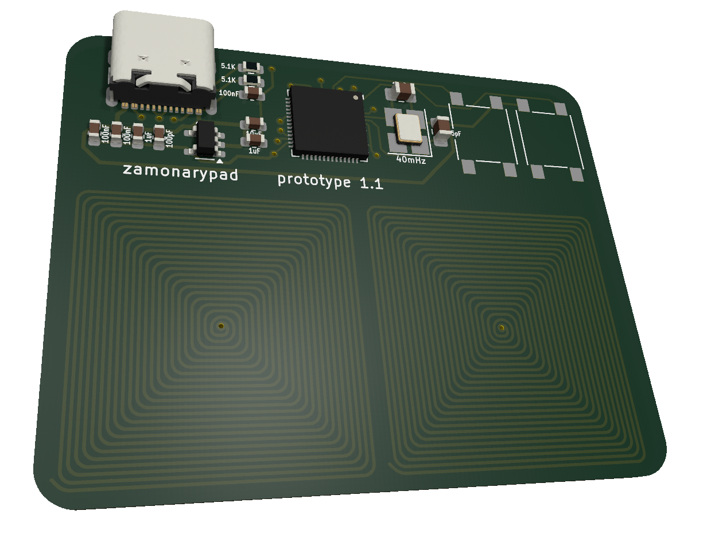

# Zamonarypad

Zamonarypad is a low-latency capacitive touch keyboard, designed specifically for osu! players or other games that require quick and precise inputs. It is based on the ESP32-S2 microcontroller, ensuring high performance and low power consumption.

## Features:
- Low input latency
- Capacitive touch sensing

## Specifications:
- Microcontroller: ESP32-S2
- Connection: USB Type-C
- Dimensions: 52.32 x 40.64 mm
- Key count: 2

## Support:
Feel free to contact me via victor.sochi.live@gmail.com for any inquiries or support. I'll be happy to assist with any issues or questions you may have.
