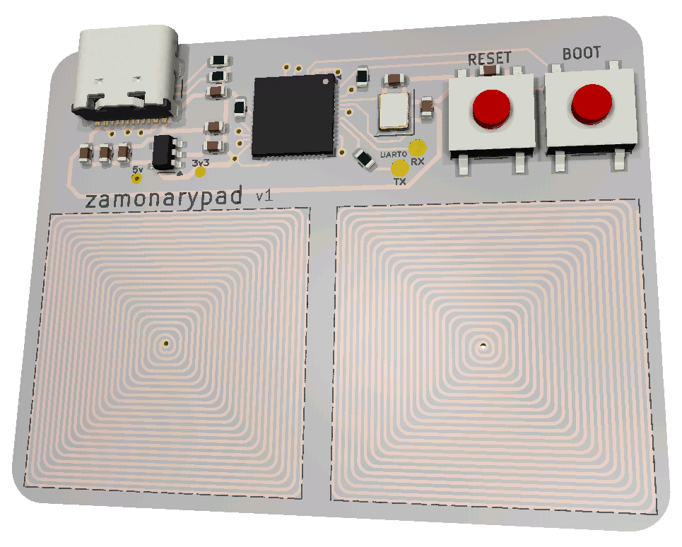

# Zamonarypad

Zamonarypad is a low-latency capacitive touch 2-key keyboard. It is based on cheap ESP32-S2 microcontroller with native USB support.

Feel free to contact me via @zamonary1 via discord, i'll be happy to assist with any issues or questions you may have.

Code is licensed with BSD 3-Clause, PCB files are licensed with Creative Commons BY-SA 4.0. You can learn more in LICENSE
